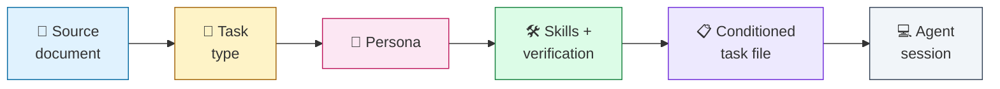

# 🐝 Swarm — Agentic Documentation Framework

> **Swarm is a documentation framework that conditions coding agents for the work they do.** Pick a source document, and a recommended task type, persona, skills, and verification gates all follow.

This directory is the canonical home of the framework. Everything you need to understand, adopt, extend, or audit Swarm lives here.

---

## ⚡ The 30-second pitch

Coding agents fail in predictable ways: they drift from intent, conflict with the existing architecture, hallucinate completion, and leave no resumable trail.

Swarm addresses these failures with a **single mechanism**: the conditioning pipeline.



A human (or upstream agent) hands a source document to the framework. Swarm has a recommended route for it: a `spec.md` suggests a `feature` task in the mindset of **The Builder**; an `audit.md` suggests a `refactor` task in the mindset of **The Janitor**; a `bug-report.md` suggests a `fix` task in the mindset of **The Skeptic**. The matching skills self-activate by directive `description`. Verification commands are bound to named slots. The agent reads one file (the conditioned task file), adopts the suggested mindset (re-assessing if the work doesn't fit), executes the task, and pastes empirical proof into a hard-gated `## Self-review`. The flow graph is **recommended routing**: a launcher may apply it deterministically, but the agent may re-assess and record the divergence.

The framework itself is just disciplined Markdown — no runtime, no DSL, no executable. A CLI (e.g., the **Swarm CLI**) implements the framework. **This repository is the framework.**

---

## 🗺️ Repo map

```
swarm/
├── docs/                          ← the framework documentation (this directory)
│   ├── README.md                  ← you are here
│   ├── PRINCIPLES.md              ← load-bearing design constraints
│   ├── NON-GOALS.md               ← what Swarm explicitly is not
│   │
│   ├── concepts/                  ← the WHY — the framework's ideas
│   ├── personas/                  ← discussion of the 13 mindsets
│   ├── tasks/                     ← discussion of the 18 task types
│   ├── documents/                 ← discussion of the 4 core doc types + extended
│   ├── skills/                    ← discussion of the shipped skills
│   ├── reference/                 ← lookup tables (compat matrix, flow graph, placeholders, glossary)
│   └── adrs/                      ← Architecture Decision Records
│
└── scaffold/                      ← the literal artefacts you copy into your repo
    ├── README.md                  ← what's in here, install procedure
    ├── AGENTS.md                  ← root agent brief (with TODO markers)
    ├── CLAUDE.md, GEMINI.md       ← cross-tool aliases
    ├── .gitignore.additions       ← lines to append to your .gitignore
    │
    ├── docs/agents/               ← human-facing process docs (ship with every project)
    │   ├── 01-process.md ··· 05-flow-graph.md
    │
    └── .agents/
        ├── skills/                ← the 23 shipped skills, each <name>/SKILL.md (+ references/)
        │   ├── adversarial-review/, distillation-discipline/, empirical-proof/   (3 quality gates)
        │   ├── fix-flaky-test/                                                   (1 specialised)
        │   ├── write-{spec,audit,research,bug-report,feature,fix,refactor,      (12 authoring)
        │   │           rewrite,migration,performance,testing,documentation}/
        │   └── persona-{architect,auditor,janitor,migrator,                     (7 personas)
        │                 performance-surgeon,skeptic,surveyor}/
        └── templates/             ← 8 flat templates with {{placeholders}}
            ├── {spec,audit,bug-report,research}.md  (4 source-doc templates)
            ├── task-base.md                         (shared task skeleton)
            ├── task-{orchestration,review}.md       (the 2 skill-less task types)
            └── skill.md                             (meta-template)
```

> Each non-persona skill also ships a `references/` directory — a `task-template.md` carrying `{{cmd*}}`/`{{slug}}` placeholders (except `distillation-discipline`, which ships `worked-example.md`, and `empirical-proof`, which ships `evasions.md`). Per-skill task templates live there, **not** in the flat `templates/` directory.

> **`/docs/` is for understanding; `/scaffold/` is for adopting.**
>
> The `/docs/` directory explains the framework — concepts, design rationale, comparisons, examples, and references. Every page links freely across `/docs/`.
>
> The `/scaffold/` directory is the skill layer Swarm governs: each `SKILL.md` **body** is self-contained — no cross-skill "See also" links, no framework-internal paths — so a skill behaves identically wherever it's vendored. Skills self-activate by directive `description`; there is no always-loaded skill. Copy `/scaffold/` into your repo's root, bind the placeholders in `AGENTS.md > Commands`, and you're conformant.

Every directory has its own `README.md` that catalogues what's inside.

---

## 🚀 Where to start

Reading order depends on who you are and why you're here:

| You are…                                     | Read this first                                                                           |
| -------------------------------------------- | ----------------------------------------------------------------------------------------- |
| 👀 Casually evaluating Swarm                 | [`concepts/01-what-is-swarm.md`](concepts/01-what-is-swarm.md) — 5 minutes                |
| 🛠️ Adopting Swarm in a real project          | [`guides/quickstart.md`](guides/quickstart.md) → [`guides/adopting-swarm.md`](guides/adopting-swarm.md) → [`/scaffold/README.md`](../scaffold/README.md) |
| 🧠 Trying to understand the mechanism        | [`concepts/02-conditioning-pipeline.md`](concepts/02-conditioning-pipeline.md)            |
| 🎭 Looking for the right persona             | [`personas/README.md`](personas/README.md) → the matrix                                    |
| 📋 Looking for the right task type           | [`tasks/README.md`](tasks/README.md) → the matrix                                          |
| 📦 Looking for the actual files to copy      | [`/scaffold/README.md`](../scaffold/README.md)                                             |
| 🧰 Building a tool that consumes Swarm       | [`reference/template-placeholders.md`](reference/template-placeholders.md)                |
| 🔬 Asking *why* the skills are shaped this way | [`skills/building/`](skills/building/) — the empirical science behind the skill layer (650-trial activation study, Reflexion, the no-always-load decision) |
| 🤝 Contributing or extending the framework   | [`guides/extending-the-framework.md`](guides/extending-the-framework.md) → [`adrs/`](adrs/) |
| 🔬 Comparing to Spec Kit / BMAD / Superpowers | [`concepts/12-prior-art.md`](concepts/12-prior-art.md)                                    |

---

## 🧭 The framework at a glance

| Dimension          | Cardinality | Where                                                       |
| ------------------ | ----------- | ----------------------------------------------------------- |
| 🎭 Persona mindsets | 13 (7 ship as skills) | [`personas/`](personas/) — 7 ship as `persona-*` skills; the other 6 are mindsets carried by the matching workflow skill |
| 📋 Task types      | 18          | [`tasks/`](tasks/)                                          |
| 📄 Core doc types  | 4           | [`documents/`](documents/) (+ extended variants)            |
| 🛠️ Skills          | 23          | [`skills/`](skills/) — 3 quality gates (`adversarial-review`, `distillation-discipline`, `empirical-proof`), 1 specialised (`fix-flaky-test`), 12 authoring (`write-*`), 7 personas (`persona-*`) |

---

## 🪞 Is this for you?

**Swarm fits when:**

- ✅ Multiple agents (or one agent across many sessions) are doing real engineering work in your repo
- ✅ You've been bitten by drift, hallucinated completion, or context pollution
- ✅ You want repeatable conditioning: the same source doc routes to the same suggested task type, persona, and skills — a recommended default the agent can re-assess and record
- ✅ Your stack is heterogeneous and you don't want a framework that bakes in `pnpm` or `cargo` or `pip`
- ✅ You like Diátaxis / Spec Kit / Superpowers but want something more rigorous on the documentation side

**Swarm is not for you (yet) if:**

- ❌ You're looking for a runtime, an agent CLI, or an inference engine — Swarm conditions agents; it doesn't run them
- ❌ You want a one-click setup with a pretty TUI — that's a CLI concern, separate from the framework
- ❌ Your project has zero structure and you want the framework to invent it for you — Swarm assumes you already write things down; it organises and amplifies that
- ❌ You want roleplay personas with names like "Mary the Analyst" — Swarm's personas are mindsets, not characters

See [`NON-GOALS.md`](NON-GOALS.md) for the full list of what Swarm explicitly is not.

---

## 📐 Status and stability

| Surface                                  | Status     |
| ---------------------------------------- | ---------- |
| Persona catalogue (13 mindsets, 7 ship as skills) | 🟢 Stable  |
| Task type catalogue (18 task types)      | 🟢 Stable  |
| Core doc types (4)                       | 🟢 Stable  |
| Flow graph (document → task → persona)   | 🟢 Stable — recommended routing, not gatekeeper-enforced |
| Template placeholder contract            | 🟢 Stable  |
| Skill set (23 skills)                    | 🟡 Evolving — see [`skills/README.md`](skills/README.md) |
| Subagent strategy                        | 🟡 Evolving — see [`concepts/10-subagent-strategy.md`](concepts/10-subagent-strategy.md) |
| Project-level overlays (constitution, ADR) | 🟠 Recommended, not required |

The framework is versioned (semver). Major version bumps are reserved for scaffold-breaking changes. See [`adrs/0015-versioning-scheme.md`](adrs/0015-versioning-scheme.md).

---

## 🔗 Related repositories

- **Swarm CLI** — implements this framework: scaffolds task files, manages worktrees, runs verification gates. The CLI lives in a separate repo. Swarm-the-framework is consumable by *any* tool that honours the [placeholder contract](reference/template-placeholders.md).
- **AGENTS.md** — the open standard Swarm builds on for repo entry points. See [`reference/agents-md.md`](reference/agents-md.md).

---

## 📜 Provenance

This documentation is consolidated from a series of design specs, persona catalogues, task templates, and field research conducted between late 2025 and mid-2026. See [`concepts/12-prior-art.md`](concepts/12-prior-art.md) for the bibliography and competitive landscape, and [`adrs/`](adrs/) for the design decisions and the alternatives that were considered and rejected.

---

> **A note on voice.** Swarm's docs are direct, opinionated, and unhedged. When something is forbidden, it says forbidden. When something is a tradeoff, it shows the tradeoff. When the field is divided, the docs pick a position and explain why. If you find a hedge that doesn't earn its place, that's a bug.
