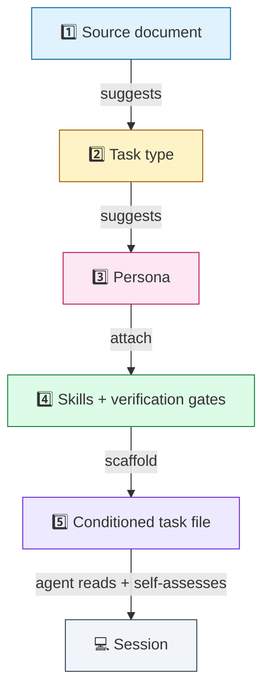
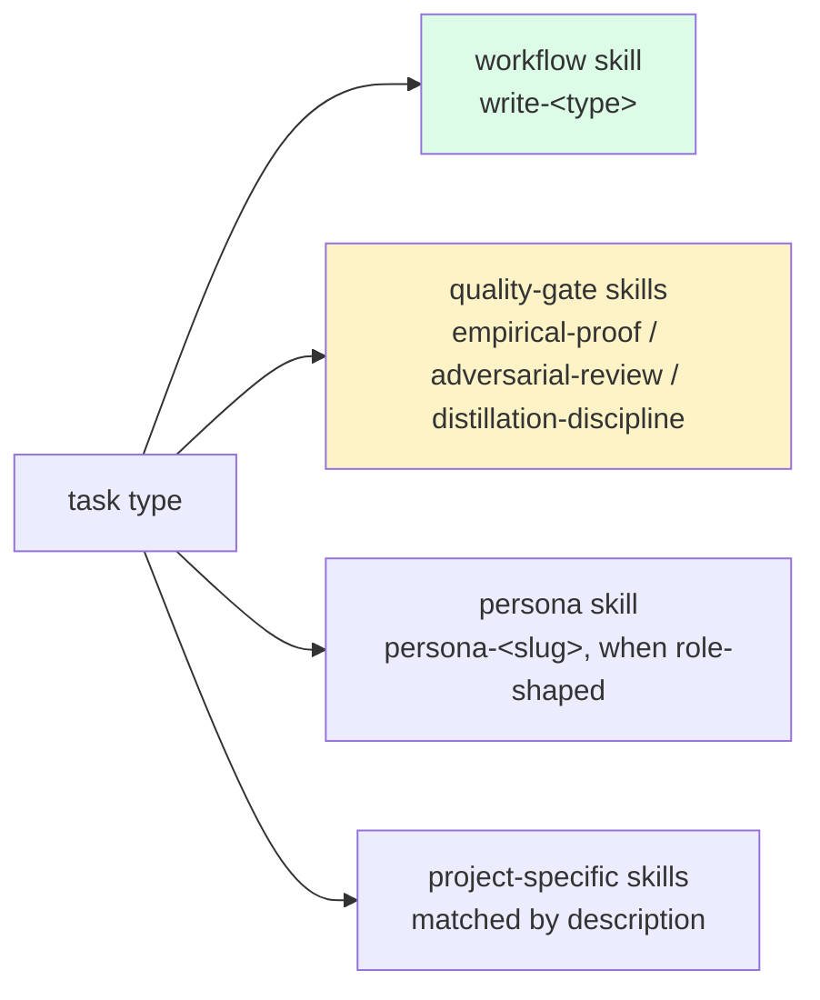
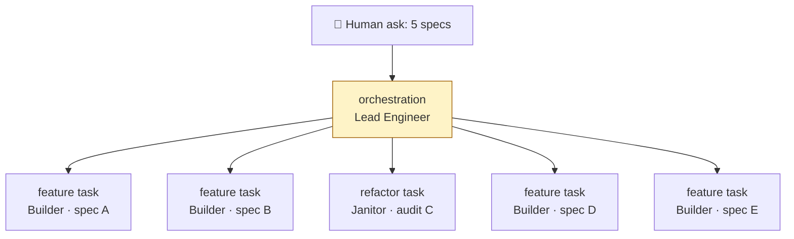

# 02 · The conditioning pipeline

> **TL;DR.** A source document suggests the task type, which suggests the persona, which suggests the skills and verification gates. The output is a fully *conditioned* task file the agent reads as its first action. The routing is **recommended, not enforced** — a launcher may apply it deterministically when scaffolding the file, and the directive skill `description`s reproduce it in-session, but the agent self-assesses and may re-route when the work doesn't match the suggested default. Same input, same starting conditioning; the agent records any divergence in its task file.

---

## 🪜 The five stages



Each arrow is a recommended routing rule. A launcher (the Swarm CLI or any compatible tool) *may* apply them deterministically when it scaffolds the task file, and the directive skill `description`s reproduce the same routing inside a session. The agent reads the conditioned file, then self-assesses: when the work matches the suggested default it proceeds; when it doesn't, it loads the skill whose `description` fits and records the divergence in `## Decisions`.

---

## Stage 1: Source document

A **source document** grounds a task. The four core types:

| Doc type        | Epistemic stance                | Spawns task type        |
| --------------- | ------------------------------- | ----------------------- |
| `spec.md`       | Forward-looking, prescriptive   | `feature`               |
| `audit.md`      | Present-looking, observational  | `refactor`              |
| `bug-report.md` | Past-looking, evidential        | `fix`                   |
| `research.md`   | Outward-looking, citational     | `spec-writing`          |

A few important corollaries:

- **A source document may be missing.** When a human says "investigate X" with no upstream artefact, the suggested route is an *authoring* task (`research-writing`, `audit-writing`, `spec-writing`, or `bug-report-writing`) that *produces* the missing source doc. Authoring tasks follow the same recommended routing — see [`05-document-types.md`](05-document-types.md) and [the flow graph](../reference/flow-graph.md).
- **Multiple source documents is a routing signal.** Five spec files in one ask suggests `orchestration` (the Lead Engineer decomposes and delegates). A spec plus prior Skeptic notes suggests `kickback` (the Builder revises).
- **Specialised variants** (migration plans, benchmark reports, ADRs, constitution) are documented in [`05-document-types.md`](05-document-types.md). They suggest specialised task types (`migration`, `performance`, etc.) but follow the same shape.

---

## Stage 2: Task type

A **task type** is the unit of work. The 18 types fall into three families:

```mermaid
flowchart LR
    subgraph 💻 Implementation
        F1[feature] & F2[fix] & F3[refactor] & F4[rewrite]
        F5[migration] & F6[performance] & F7[testing]
        F8[integration] & F9[upgrade] & F10[kickback]
    end
    subgraph ✍️ Authoring
        A1[spec-writing] & A2[audit-writing]
        A3[research-writing] & A4[bug-report-writing]
    end
    subgraph 🔁 Process
        P1[review] & P2[deepen-audit]
        P3[orchestration] & P4[documentation]
    end
```

Each task type has:

- A **suggested lead persona** (one default; the agent may re-assess — see [ADR 0002](../adrs/0002-personas-1-to-1-with-task-types.md), superseded to suggested defaults)
- A set of **skills worth loading**
- A list of **verification gate slots** that fire at specific phases
- A **template** that pre-conditions the task file

Full catalogue: [`tasks/`](../tasks/). Single-page reference: [`reference/flow-graph.md`](../reference/flow-graph.md).

---

## Stage 3: Persona

A **persona** is a mindset, not a role. It carries:

- A **role statement** (one paragraph)
- A **mindset** (the frame the agent must adopt)
- **Hard constraints** (numbered, no hedging)
- **Forbidden actions** (the negative space)
- **Decision heuristics** (tiebreakers when rules don't directly apply)
- **Empirical proofs** the persona must produce
- A **self-review checklist**
- **Anti-patterns** (concrete failure modes the persona resists)
- **Handoff partners** (who hands off to whom)

The catalogue describes **13 mindsets** at [`personas/`](../personas/). Seven of them ship as runtime skills (`persona-architect`, `persona-auditor`, `persona-janitor`, `persona-migrator`, `persona-performance-surgeon`, `persona-skeptic`, `persona-surveyor`); the other six (Builder, Bug Hunter, Documentarian, Lead Engineer, Researcher, Test Author) are mindsets carried by the matching workflow skill (Builder → `write-feature`, Bug Hunter → `write-bug-report`, Documentarian → `write-documentation`, Researcher → `write-research`, Test Author → `write-testing`; Lead Engineer is orchestration with no skill).

The task-type → persona mapping is a **suggested default**, not a forced pick: the launcher may pre-name a persona and the directive skill `description`s reproduce the routing, but the agent self-assesses and may load a different persona skill when the work warrants it, recording the divergence in `## Decisions`. See [ADR 0002](../adrs/0002-personas-1-to-1-with-task-types.md) (the original 1:1 mapping is superseded to suggested defaults).

---

## Stage 4: Skills + verification gates

**Skills** are progressively-disclosed knowledge modules. There is **no always-loaded skill** — each skill carries a directive `description` ("ALWAYS apply this skill when … Do not … Skip this skill for …") and self-activates when its triggers match the work. The task type suggests which skills are worth loading; the agent confirms the match.



The old always-loaded skills (`manage-task` and `documentation-gatekeeper`) no longer exist. `manage-task`'s task-file lifecycle and promotion discipline now live in the task templates and the process docs; `documentation-gatekeeper`'s routing and forbidden-flow rules are now framework concept docs (recommended routing — see [`07-flow-graph.md`](07-flow-graph.md)), not an enforced skill.

**Verification gates** are *named slots* the framework defines. The project binds the slots to literal commands in `AGENTS.md > Commands` (e.g., `Validation` → `pnpm run check` in a TS shop, → `cargo check` in a Rust shop); the launcher fills the `{{cmd*}}` placeholders in the task template from those entries. Skill bodies reference the entries by name (`AGENTS.md > Commands > Validation`) and degrade gracefully — if a binding is missing they ask the user. The framework cares only about the slots.

| Slot (placeholder → `Commands` entry)       | Fires for                                                   |
| ------------------------------------------- | ----------------------------------------------------------- |
| `{{cmdInstall}}` (`Commands > Install`)     | Pre-implementation, every code-producing task               |
| `{{cmdValidate}}` (`Commands > Validation`) | Periodic + post-implementation, every code-producing task   |
| `{{cmdTest}}` (`Commands > Test`)           | Post-implementation, every code-producing task              |
| `{{cmdValidateDeps}}` (`Commands > ValidateDeps`) | After every batch on `refactor`/`migration`           |
| `{{cmdBenchmark}}` (`Commands > Benchmark`) | Baseline + target on `performance`                          |
| `{{cmdTypecheck}}` (`Commands > Typecheck`) | Static analysis on `refactor`/`feature` (where applicable)  |

Full list: [`reference/template-placeholders.md`](../reference/template-placeholders.md).

---

## Stage 5: The conditioned task file

The output of the pipeline is a **fully conditioned task file**. By the time the agent sees it:

- The suggested persona is named (in a `> **PERSONA:**` blockquote)
- The skills worth loading are listed (in `## Skills` and `## Domain skills`)
- The source doc is linked (in `## Linked docs`)
- The verification gate slots are populated with the project's commands
- The constraints are filled in (from the task type's template plus the persona's forbidden actions)
- The Self-review checklist is pre-written, with empty answer slots and `[Paste output]` placeholders

The agent's first action is to **read this file**. It arrives pre-conditioned with a suggested persona, a list of skills worth loading, and a Self-review that defines "done" — so the agent doesn't start from a blank slate. It still self-assesses: if the suggested persona or routing doesn't fit the work, it adopts the persona skill whose `description` matches and records the divergence in `## Decisions`.

Templates for every task type live at [`tasks/`](../tasks/). The base template (the shared skeleton) is at [`reference/task-base.md`](../reference/task-base.md).

---

## 🔁 The override semantics

The routing is a recommended default, not a forced pick. There are four legitimate ways the actual conditioning diverges from the suggested route:

1. **In-session re-assessment.** The agent reads its conditioned task file, finds the suggested persona or task type doesn't fit the work in front of it, loads the persona/workflow skill whose `description` matches, and records the divergence in `## Decisions`. This is the everyday case — nothing in-session blocks it.
2. **Project-level override.** The project's launcher config (a CLI artefact, not a framework artefact) can override the default persona for any task type. Example: a team that prefers minimality over adversarial focus might map `fix` away from The Skeptic to a dedicated Fixer persona.
3. **Task-launch override.** When a human launches a task, they can name a different task type than the default for the source doc — e.g., treating an `audit.md` as a `deepen-audit` task instead of `refactor`. This is for cases where the human knows something the document doesn't say.
4. **Project-level overlay personas.** A project can introduce new personas that the framework doesn't ship — e.g., a Type Surgeon for a TypeScript shop, or a SecurityReviewer for a regulated codebase. Overlays add a persona skill at the project level; the framework's catalogue remains 13 mindsets (7 shipped as skills).

When the routing is overridden at the launcher or human layer, the framework prefers loud reclassification over silent re-routing.

---

## ♻️ Recursion

The pipeline runs recursively. A task can spawn sub-tasks; each sub-task is itself a `(source doc, task type, persona)` triple, conditioned in exactly the same way.

The most common recursion is the **Lead Engineer pattern**:



Each child task gets its own worktree, branch, conditioned task file, and agent CLI session. The Lead Engineer's task file tracks all children — slug, branch, status, last review verdict.

The recursion limit is set per project. Default: **2**. See [`08-recursion-and-delegation.md`](08-recursion-and-delegation.md) and [ADR 0014](../adrs/0014-recursion-renamed-delegation.md).

---

## 🪞 Worked example

Suppose a human writes:

> "We need to add support for OAuth2 PKCE flow to the auth module. Here's a research file: `.agents/research/oauth2-pkce.md`."

The pipeline runs:

1. **Source doc:** `research/oauth2-pkce.md`. Type: research.
2. **Task type:** `spec-writing` (research suggests spec-writing — see [the flow graph](../reference/flow-graph.md)).
3. **Suggested persona:** The Architect (carried by the `write-spec` workflow skill).
4. **Skills worth loading:** `write-spec`, `distillation-discipline`, plus any project-specific architecture skill matched by description.
5. **Verification gates:** post-implementation `git status` (must be clean on source — spec sessions are read-only on code).
6. **Conditioned task file scaffolded** at `.agents/tasks/spec-oauth2-pkce.md` with all of the above pre-filled.

The agent reads the file, adopts The Architect, surveys existing auth patterns, drafts the spec at `.agents/specs/oauth2-pkce.md`, fills in `## Self-review` with pasted `git status` output proving zero source files were modified, and closes the task.

Now the spec exists. A second pipeline run starts:

1. **Source doc:** `specs/oauth2-pkce.md`. Type: spec.
2. **Task type:** `feature`.
3. **Suggested persona:** The Builder (carried by the `write-feature` workflow skill).
4. **Skills worth loading:** `write-feature`, `empirical-proof`, plus project-specific.
5. **Verification gates:** `Commands > Install` pre-implementation, `Commands > Validation` after each batch, `Commands > Validation` and `Commands > Test` post-implementation (the task template binds these to `{{cmdInstall}}`/`{{cmdValidate}}`/`{{cmdTest}}` from `AGENTS.md > Commands`).
6. **Conditioned task file scaffolded** at `.agents/tasks/feat-oauth2-pkce.md`.

Same machinery, different inputs, different conditioning. The agent arrives pre-conditioned and self-assesses against the work before proceeding.

---

## 🎯 Why recommended routing (not free-for-all)

You might expect a framework to leave every choice open at launch. Swarm pre-conditions instead, then lets the agent re-assess. The trade is intentional:

| Unconditioned launch                                            | Recommended routing (the chosen position)          |
| --------------------------------------------------------------- | -------------------------------------------------- |
| Agent picks persona from a blank slate every time               | Agent arrives with a suggested persona; re-routes only when it doesn't fit |
| Source doc maps to nothing in particular                        | Source doc suggests one default task type          |
| Many-to-many ambiguity at launch                                | One suggested default, with explicit divergence recorded |
| Maximum options, maximum decision fatigue                       | Removes a class of decision-fatigue failure while keeping the agent free to re-assess |
| Ambiguous source docs silently pick whatever flatters continuation | Ambiguous source docs trigger explicit reclassification |
| Hard to reason about behaviour across sessions                  | Same input → same starting conditioning, divergences logged in `## Decisions` |

The framework treats the pre-conditioning as a starting point, not a cage. The agent is best when it doesn't start from zero on every task — the human and the doc together suggest a route — but it stays free to re-assess and record why when reality straddles the suggested defaults.

---

## See also

- [`05-document-types.md`](05-document-types.md) — what each source doc looks like
- [`06-task-types.md`](06-task-types.md) — the full task catalogue with rationale
- [`07-flow-graph.md`](07-flow-graph.md) — the conceptual graph
- [`../reference/flow-graph.md`](../reference/flow-graph.md) — the operational tables
- [`../reference/template-placeholders.md`](../reference/template-placeholders.md) — the placeholder contract
- [ADR 0002](../adrs/0002-personas-1-to-1-with-task-types.md) — the original 1:1 persona↔task mapping, superseded to suggested defaults
