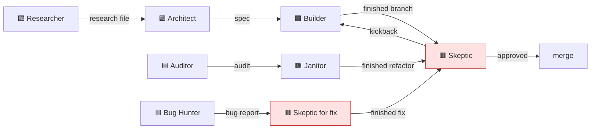
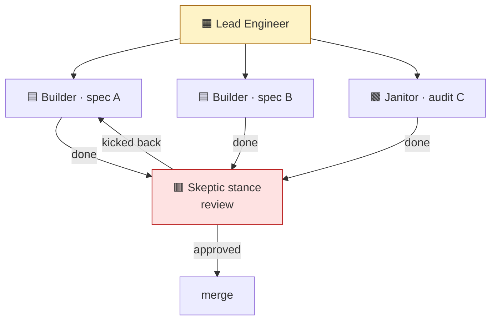

# 04 · Personas

> **TL;DR.** Personas are *mindsets*, not roles. Same agent, same model — different stance, different output. The catalogue is **13 mindsets**; **7 ship as runtime skills** (`persona-<slug>`) and the other 6 are mindsets carried by the matching workflow skill. Each task type has one *suggested* default persona — the agent arrives pre-conditioned but may re-assess. Personas have hard rules, forbidden actions, and required empirical proofs. They hand off to each other along the flow graph.

---

## 🎭 Persona-as-mindset, not persona-as-role

The framework deliberately rejects the "named character" model used by some other frameworks (BMAD-METHOD's *Mary the Analyst*, *Devon the Dev*, etc.).

| Persona-as-role (rejected)                            | Persona-as-mindset (chosen)                                  |
| ----------------------------------------------------- | ------------------------------------------------------------ |
| Named after a person ("Mary", "Devon")                | Named after a stance ("Builder", "Skeptic")                  |
| Implies a character with a personality                | Implies a frame of mind                                       |
| Encourages roleplay                                   | Encourages constraint-following                               |
| 21+ characters → coordination overhead                | 13 mindsets → memorisable surface                            |
| Persona switches feel theatrical                      | Persona switches feel like changing tools                     |

The Builder is the Builder because *building* requires a particular stance — pragmatic, delivery-focused, satisfying the spec exactly without over-engineering. The Skeptic is the Skeptic because *reviewing* requires the opposite stance — paranoid, hostile to claims, paste-the-output-or-don't-believe-it.

A single human engineer holds all 13 mindsets and switches between them as the work changes. A persona is what the framework names so the agent can switch *deliberately* rather than drifting into default-helpfulness on every task.

See [ADR 0009](../adrs/0009-personas-are-mindsets.md).

---

## 🧬 What every persona profile contains

The conceptual catalogue at [`personas/`](../personas/) describes all 13 mindsets — routing wedges, contrasts, hazards. The *executable* profile for each of the 7 shipped personas lives in its own runtime skill at `.agents/skills/persona-<slug>/SKILL.md` (split out from the old consolidated `personas/SKILL.md`). For the other 6 mindsets, the executable discipline is folded into the matching workflow skill (Builder → `write-feature`, Bug Hunter → `write-bug-report`, Documentarian → `write-documentation`, Researcher → `write-research`, Test Author → `write-testing`; Lead Engineer is orchestration with no skill).

A persona profile — whether a standalone `persona-<slug>` skill or carried inside a workflow skill — follows the same structure:

```markdown
# Persona: <Display name>

## TL;DR
One paragraph that answers: when do I become this persona, and what does that change?

## Role
What this persona is responsible for.

## Mindset
The frame the agent must adopt. Stated as imperatives.

## Hard constraints
Numbered. No hedging.

## Forbidden actions
Numbered. The negative space.

## Decision heuristics
Tiebreakers when rules don't directly apply.

## Triggering documents
Which source docs lead to this persona.

## Triggering task types
Which task types suggest this persona by default.

## Skills worth loading
The skills worth loading alongside this persona's work.

## Empirical proofs required
What must be pasted into Self-review.

## Self-review focus
Persona-specific questions in Self-review.

## Anti-patterns
Concrete failure modes the persona resists.

## Red flags
Rationalisations the persona refuses to accept (the "iron law" pattern).

## Example: how this persona resolves a representative issue
A short worked example showing the persona's thinking on a real-shaped problem.

## Handoff partners
Who hands off to whom (← receives from / → delivers to).
```

The format is borrowed from the *Superpowers* framework's "iron law + red flags" pattern (see [`12-prior-art.md`](12-prior-art.md)) and codified in [ADR 0013](../adrs/0013-iron-law-red-flags-pattern.md).

---

## 📋 The 13 mindsets (7 ship as skills)

The full catalogue lives at [`personas/`](../personas/). The `Ships as` column shows where each mindset's executable profile lives: a standalone `persona-<slug>` skill, or carried inside the named workflow skill.

| Persona                  | Primary task types                       | Stance            | Ships as                    |
| ------------------------ | ---------------------------------------- | ----------------- | --------------------------- |
| 🟦 [The Builder](../personas/the-builder.md)           | feature, integration, kickback           | Pragmatic         | `write-feature` (mindset)   |
| 🟥 [The Skeptic](../personas/the-skeptic.md)           | review, deepen-audit, fix                | Paranoid          | **`persona-skeptic`**       |
| 🟪 [The Architect](../personas/the-architect.md)       | spec-writing                             | Structural        | **`persona-architect`**     |
| 🟫 [The Janitor](../personas/the-janitor.md)           | refactor                                 | Surgical          | **`persona-janitor`**       |
| 🟧 [The Lead Engineer](../personas/the-lead-engineer.md) | orchestration                          | Coordinative      | orchestration (no skill)    |
| 🟩 [The Researcher](../personas/the-researcher.md)     | research-writing (technical)             | Evidentiary       | `write-research` (mindset)  |
| 🟩 [The Surveyor](../personas/the-surveyor.md)         | research-writing (UX/market)             | Empathetic        | **`persona-surveyor`**      |
| 🟥 [The Bug Hunter](../personas/the-bug-hunter.md)     | bug-report-writing                       | Forensic          | `write-bug-report` (mindset) |
| 🟦 [The Auditor](../personas/the-auditor.md)           | audit-writing                            | Observational     | **`persona-auditor`**       |
| 🟫 [The Migrator](../personas/the-migrator.md)         | migration, upgrade                       | Mechanical        | **`persona-migrator`**      |
| 🟨 [The Performance Surgeon](../personas/the-performance-surgeon.md) | performance              | Quantitative      | **`persona-performance-surgeon`** |
| 🟩 [The Test Author](../personas/the-test-author.md)   | testing                                  | Boundary-pushing  | `write-testing` (mindset)   |
| 🟦 [The Documentarian](../personas/the-documentarian.md) | documentation                          | Reader-first      | `write-documentation` (mindset) |

Total: 13 mindsets, 7 shipped as `persona-<slug>` skills (bold). The remaining 6 are carried by the workflow skill that owns the matching work — there is no separate skill to load. The task-type → persona pairing is a *suggested* default: each mindset is the recommended stance for 1+ task types, and the agent may re-assess. Some task types (like `kickback`) re-use a mindset in a different mode.

For the full task-type ↔ persona map, see [the compatibility matrix](../reference/compatibility-matrix.md).

---

## 🤝 Handoff and composition

Personas hand off along the flow graph. Most handoffs end with **The Skeptic** — the framework's adversarial reviewer:



Notable handoffs:

- **Architect → Builder.** Specs go to features. The Architect's deliverable is the contract; the Builder implements it.
- **Auditor → Janitor.** Audits go to refactors. The Auditor identifies; the Janitor cleans.
- **Bug Hunter → Skeptic-for-fix.** Bug reports go to fix tasks, which adopt the Skeptic mindset (because root-causing demands hostility — see [ADR 0006](../adrs/0006-skeptic-owns-fix-tasks.md)).
- **Anyone → Skeptic-for-review.** Every code-producing persona ends their branch by handing off to the Skeptic for adversarial review.

The Skeptic is the framework's **universal terminal node** for code-producing work. This is by design — the discipline is what makes the framework's empirical-proof rule load-bearing rather than aspirational.

---

## ♻️ The Lead Engineer pattern (recursion)

The **Lead Engineer** is the only persona that doesn't write code. Its job is to *decompose* a complex task into independent sub-tasks, *delegate* each sub-task to a worker (a fresh agent CLI session in its own worktree), *adopt the Skeptic mindset* to review each worker's branch, and *merge* the approved branches.



The Lead Engineer **becomes** the Skeptic for each review pass. This is a deliberate persona switch, not a blend — the Lead Engineer's task file documents the switch and the empirical proofs (each worker's branch validated by the Lead Engineer, not trusting the worker's self-review).

For the full pattern, see [`08-recursion-and-delegation.md`](08-recursion-and-delegation.md).

---

## 🚫 No persona blending

A core anti-pattern: blending personas mid-session ("I'll be a Builder, but also a bit of a Skeptic"). The personas have *different empirical proofs required* and *different forbidden actions*; blending them dilutes both.

If you find yourself wanting to switch personas mid-task:

1. **Surface the concern** — record it in the task file's `## Findings` or `## Decisions`.
2. **Halt the current task** — close it as `paused` or `requires-clarification`.
3. **Promote the finding** if it's about a different scope.
4. **Open a new task** with the right persona.

The framework prefers two crisp tasks over one blended one. The cost of splitting is lower than the cost of ambiguity.

---

## 🛠️ Project-level overlays

Sometimes a project has work that doesn't fit cleanly into a framework persona — a regulated codebase needs a SecurityReviewer; a TypeScript-heavy shop needs a TypeSurgeon for variance-architecture work; an SDK-integration shop needs an Integrator. The framework supports these as **overlays**:

- The project adds its own persona skill at `.agents/skills/persona-<name>/SKILL.md` with a directive `description` so it self-activates on matching work
- Project tasks can route to the overlay persona via the project's launcher config (CLI concern), or the agent loads it in-session when the `description` matches
- The framework's catalogue remains 13 mindsets (7 shipped); the project remains expressive

Overlays do not need an ADR or framework approval. They are a project decision. The framework graduates an overlay to canonical only when many projects independently demand it.

For guidance, see [`guides/customizing-personas.md`](../guides/customizing-personas.md).

---

## 🪞 The "costume vs constraint" test

A common failure: treating the persona as a costume rather than a stance. The signs:

- The agent says "as the Skeptic, I find that…" but the finding is a vague concern, not a file:line citation.
- The agent says "as the Builder, I implement…" but the implementation drifts from the spec without flagging.
- The agent says "as the Architect, I design…" but the design includes implementation details the spec shouldn't carry.

The persona is a **constraint set**, not a label. The hard rules are real. The forbidden actions are real. The empirical proofs are real. If the persona's name is on the task file but the constraints aren't being honoured, the persona is being worn as a costume.

The framework's response is the **Self-review hard gate**. The agent cannot close the task without pasting empirical proof matching the persona's requirements. The constraint mechanism enforces the constraint stance.

---

## See also

- [`personas/`](../personas/) — the full catalogue, one file per persona
- [`05-document-types.md`](05-document-types.md) — what personas consume and produce
- [`06-task-types.md`](06-task-types.md) — what personas execute
- [`07-flow-graph.md`](07-flow-graph.md) — how personas hand off
- [`09-empirical-proof.md`](09-empirical-proof.md) — the discipline that prevents costume-mode
- [ADR 0002](../adrs/0002-personas-1-to-1-with-task-types.md) — the original 1:1 persona↔task mapping, superseded to suggested defaults
- [ADR 0009](../adrs/0009-personas-are-mindsets.md) — why mindset, not role
- [ADR 0013](../adrs/0013-iron-law-red-flags-pattern.md) — the persona profile format
