# 11 · Session lifecycle

> **TL;DR.** A session starts when an agent CLI opens a worktree and reads its conditioned task file. It ends when the task file's `## Self-review` is complete and the task moves to a terminal state (`done`, `kicked-back`, or `abandoned`). Across sessions in the same worktree, the task file is the resumption record — `## Decisions`, `## Findings`, `## Next steps`, and `## Self-review` together let a fresh agent pick up exactly where the last one left off. Task files are gitignored; durable findings migrate upstream before the worktree is deleted.

---

## 🪜 The lifecycle in one diagram

```mermaid
stateDiagram-v2
    [*] --> Scaffolded: launcher creates conditioned task file
    Scaffolded --> Active: agent reads file + adopts persona
    Active --> Active: work proceeds, checkpoints fire
    Active --> Paused: session ends mid-task
    Paused --> Active: fresh session resumes from task file
    Active --> SelfReview: agent declares work complete
    SelfReview --> Active: hard gate fails (claim unsupported)
    SelfReview --> Done: hard gate passes; durable findings promoted
    SelfReview --> KickedBack: Skeptic review fails (separate task)
    Active --> Abandoned: blocker is unresolvable
    Done --> [*]: worktree closed
    KickedBack --> [*]: handed off
    Abandoned --> [*]: documented + closed
```



Each transition has a defined trigger and a defined effect on the task file. Nothing is implicit.

---

## 🛫 Stage 1: Scaffolded

The launcher (CLI or human) creates the conditioned task file at `.agents/tasks/<slug>.md`. By the time the agent sees it:

- Metadata is filled in (slug, branch, base, worktree path, created timestamp, status `active`)
- The suggested persona is named in the `> **PERSONA:**` blockquote
- Source doc(s) are linked
- The skills worth loading are listed (workflow skill, quality-gate skills, the `persona-<slug>` skill for the 7 shipped personas, project-specific skills matched by description) — each self-activates by its directive `description`; there is no always-loaded skill
- Verification gate slots are bound to project commands from `AGENTS.md > Commands`
- Constraints include the persona's forbidden actions
- Self-review checklist is pre-written with empty answer slots

The task file is **the agent's first read**. It carries everything the agent needs to work — no separate prompt, no separate config, no separate setup.

---

## 🛠️ Stage 2: Active

The agent works. The framework's expectations during Active:

- **Plan first.** The agent fills in `## Plan` before implementation. The plan is a forecast; deviations are recorded.
- **Check off progress.** Each item in `## Progress checklist` is marked as it completes.
- **Record decisions.** Significant choices go in `## Decisions` with rationale.
- **Capture findings.** Codebase discoveries worth preserving go in `## Findings` — and durable ones get *promoted* to upstream docs.
- **Surface assumptions.** Every assumption marked `[pending]` or `[confirmed]`. The framework pushes the agent to make assumptions visible rather than silent.
- **Surface blockers.** Anything preventing confident progress goes in `## Blockers` immediately, not at the end.
- **Run gates at checkpoints.** Periodic verifications (e.g., `AGENTS.md > Commands > ValidateDeps` every 10 files for refactors, `Commands > Validation` after each wave for migrations) fire as the work proceeds and outputs paste into Self-review.

The task file evolves continuously; it is not a single artefact written at the end. By design, the task file at any moment in time is a complete resumption record.

---

## ⏸️ Stage 3: Paused (between sessions)

A session can end mid-task. The agent runs out of context, the human closes the terminal, the model session times out, or the work is intentionally paused for review.

When a session ends without the task being complete, the agent's *last action* is to update `## Next steps`:

```markdown
## Next steps

Concrete starting points for the next session if this one ends incomplete.

- The migration's wave 2 is in progress. Files migrated so far: see `## Progress checklist`. Remaining files in `src/auth/`. Next: continue with `src/auth/oauth/callback.ts`.
- Wave 1's validation passed (output above). Wave 2's mid-wave validation has not yet run.
- One open question: should `legacyTokenAdapter` be removed in this migration or in a follow-up? Recorded in `## Decisions` as `[pending]`.
- Resume command: `git checkout migration/oauth-v2 && pnpm install && pnpm test`
```

This is the resumption record. The next session reads:

1. The task file (now updated with the latest state)
2. The persona profile (re-adopts the mindset)
3. The linked source docs (re-grounds the work)

…and proceeds from `## Next steps`. No re-discovery of context, no re-investigation of decisions already made.

---

## ✅ Stage 4: Self-review (the hard gate)

The agent declares the work complete. The Self-review section becomes the gate.

The agent works through the persona's questions, **writing answers below each question**, and pasting the verification outputs in the `### Verification outputs` subsection. See [`09-empirical-proof.md`](09-empirical-proof.md) for what proof looks like.

If a question can't be answered (a verification output is missing, an empirical claim is unsupported), the gate fails. The agent returns to Active until the answer can be written truthfully.

Three terminal outcomes from Self-review:

| Outcome      | What it means                                                                                  |
| ------------ | ---------------------------------------------------------------------------------------------- |
| **Done**     | Self-review answered fully; durable findings promoted upstream; status updated to `done`       |
| **Kicked-back** | Self-review surfaces a blocker that requires a different persona or scope; status updated to `kicked-back`; new task spawned (often a `kickback` task or a fresh authoring task) |
| **Abandoned** | The task is unsalvageable; recorded in `## Decisions` with rationale; status updated to `abandoned` |

---

## 🔚 Stage 5: Terminal (worktree closed)

After Self-review passes, the framework's standing convention:

1. **Promote durable findings.** Anything in `## Findings` that should outlive the task gets edited into the relevant upstream doc (audit, spec, research, or bug-report). The task template's pre-close checklist (see below) requires this before terminal status.
2. **Hand off to downstream.** If the task ended with a Skeptic review needed (most code-producing tasks), the next task is a `review` task — created with the worker's branch as the source. If the task itself was the review, the verdict propagates back to the worker.
3. **Close the worktree.** The branch is merged (or kicked back, or abandoned), the worktree is removed (`git worktree remove`), and the task file — still gitignored — is deleted along with it.

The framework's load-bearing rule: **task files are gitignored**. Anything captured only in the task file is lost. The promotion protocol prevents that loss. See [`03-distillation.md`](03-distillation.md) and [ADR 0004](../adrs/0004-task-files-are-gitignored.md).

---

## 🧠 Why the task file is the resumption record

The framework deliberately *does not* try to solve the long-context-coherence problem at the model layer. Models can be replaced; sessions can time out; agents can swap mid-task. The framework's response is to externalise state into a file the *next* session can read.

The resumption record consists of four sections, working together:

| Section            | Purpose                                                                       |
| ------------------ | ----------------------------------------------------------------------------- |
| `## Decisions`     | Non-obvious choices the next agent should know but might not re-make the same way |
| `## Findings`      | Discoveries the next agent shouldn't have to re-discover                      |
| `## Next steps`    | Concrete starting points so the next agent doesn't have to figure out where to begin |
| `## Self-review`   | Already-pasted verification outputs the next agent can trust (and re-validate if changes have happened since) |

A fresh agent reading these four sections, plus the linked source docs, is in the same epistemic position as the previous agent at the moment they stopped. The model's context window is empty; the file's content is full.

---

## 🪜 The promotion protocol (lifecycle discipline)

Every task template embeds a pre-close checklist that the agent must complete before moving the task to `done` — there is no separate always-loaded skill enforcing it; the discipline lives in the template and the process docs:

```markdown
## Pre-close checklist

- [ ] All `## Findings` are either promoted upstream or marked `[session-only]` with justification
- [ ] All `[pending]` assumptions are either resolved (`[confirmed]`) or surfaced as a blocker
- [ ] All `## Blockers` are either resolved or escalated (with the escalation recorded)
- [ ] `## Next steps` is empty (because the work is complete) OR points to the follow-up task spawned
- [ ] `## Self-review` is fully answered with empirical proof
- [ ] Status field updated from `active` to `done`
```

The checklist keeps the agent from closing the task with unpromoted findings or unresolved blockers. This is the structural defence against silent loss — carried by the template, reinforced by the `empirical-proof` skill's refusal to accept an unproven Self-review.

---

## 🛡️ Anti-patterns at the lifecycle boundaries

Common ways the lifecycle goes wrong:

| Boundary                | Anti-pattern                                                       | Defeated by                                                  |
| ----------------------- | ------------------------------------------------------------------ | ------------------------------------------------------------ |
| Scaffolded → Active     | Agent skips reading the persona profile; defaults to "helpful"      | The persona blockquote names the suggested persona and its skill; the persona/workflow skill self-activates on the matching work |
| Active → Paused         | Agent doesn't update `## Next steps` before stopping               | The task template's before-pause checklist enumerates the step |
| Paused → Active         | Fresh agent re-discovers context already captured                  | The fresh agent's first read is the task file (everything is in there) |
| Active → Self-review    | Agent declares done without running gates                          | Self-review's hard gate refuses incomplete answers           |
| Self-review → Done      | Findings stay in the task file (which is about to be deleted)      | The pre-close checklist blocks `done` status until promotion is complete |
| Done → (worktree close) | Branch merged without Skeptic review                               | Task type's hand-off table requires the review task to be spawned |

---

## 🔌 What the framework does *not* solve

The framework provides a resumption record. It does not solve:

- **Context-window overflow during a single session.** When the agent's working context fills up, the model has to summarise or drop earlier content. The framework can't prevent this; it can only provide a *resumption point* if the agent has to restart.
- **Cross-worktree state.** Two parallel worktrees don't share state. The Lead Engineer's task file is the cross-worktree coordination point; there's no automatic state sharing.
- **Cross-project memory.** A finding in project A doesn't automatically apply to project B. The framework's per-project doc structure is the boundary.
- **Long-term institutional memory.** The framework supports session-to-session continuity within a project; it does not solve "the engineer who wrote the auth module left the company three years ago." That's a documentation discipline problem, not a framework problem — and the documentation produced by Swarm tasks is the partial answer.

These are real limits. They define what the framework promises and what it doesn't.

---

## 📊 A worked example: a 3-session refactor

### Session 1 (Monday morning)

- The Janitor (via the `persona-janitor` skill) reads `.agents/tasks/refactor-auth-module.md`. Source: `.agents/audits/auth-module-2026-q2.md`.
- Plans the refactor: 6 batches of files, with the dependency-boundary check (`AGENTS.md > Commands > ValidateDeps`) between each batch.
- Completes batches 1–3. Pastes outputs into Self-review's verification subsection.
- Discovers that `tokenStore.legacy` has zero callers. Records in `## Findings`. Promotes to the audit as a recommendation for a separate cleanup task.
- 6pm — out of time. Updates `## Next steps`: "Resume at batch 4. `src/auth/middleware/*`. The `legacyTokenAdapter` shim has been migrated; run `Commands > ValidateDeps` before continuing."

### Session 2 (Wednesday morning, fresh agent)

- New agent CLI session opens the same worktree.
- Reads the task file.
- Re-adopts The Janitor.
- Reads `## Next steps`: knows where to resume.
- Re-runs `Commands > ValidateDeps` to confirm the worktree is in the state the previous agent claimed. Pastes the output (matches the previous Self-review's checkpoint output — good).
- Completes batches 4–6.
- Self-review hard gate: pastes final `Commands > ValidateDeps` and `Commands > Typecheck` output. All green.
- Status: `done`. The branch is ready for Skeptic review.

### Session 3 (Wednesday afternoon, Skeptic)

- Skeptic-review task is spawned with the Janitor's branch as the source.
- Skeptic (via the `persona-skeptic` skill) reads the diff, runs `Commands > Validation` and `Commands > Test` themselves (does not trust the Janitor's pasted output).
- Finds two file:line issues — one BLOCKER, one MINOR.
- Verdict: KICK BACK. Kickback task spawned with the original audit + the Skeptic's notes as `## Linked docs`.

### What survived across the three sessions

- The audit (`.agents/audits/auth-module-2026-q2.md`) — gained one new finding (the `tokenStore.legacy` cleanup recommendation).
- The branch — has 6 batches of clean refactors plus the upcoming kickback fix.
- The task file at the end of session 2 — about to be deleted with the worktree, but everything important has already been promoted upstream or is captured in the Skeptic's review file.

This is the lifecycle working as designed: continuous progress, durable knowledge preserved, no context lost across the three model sessions.

---

## See also

- [`03-distillation.md`](03-distillation.md) — the promotion protocol in detail
- [`08-recursion-and-delegation.md`](08-recursion-and-delegation.md) — multi-session orchestration
- [`09-empirical-proof.md`](09-empirical-proof.md) — the Self-review hard gate
- [`tasks/`](../tasks/) — every task template embeds the lifecycle structure and the pre-close checklist
- [ADR 0004](../adrs/0004-task-files-are-gitignored.md) — why task files are gitignored
