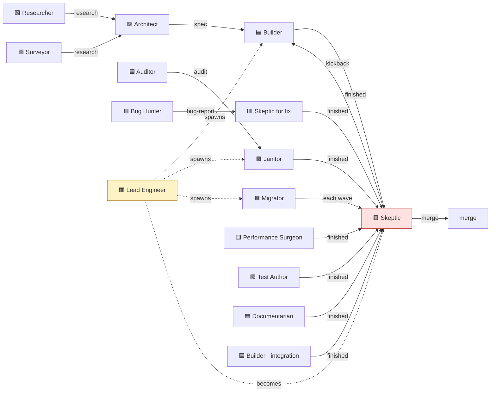

# 🎭 Personas

> The 13 mindsets that condition agents in Swarm. Each persona has its own page; this README is the catalogue and the index.

> 📦 **`/docs/personas/` is conceptual — routing wedges, contrasts, hazards.** Of the 13 mindsets, **7 ship as executable persona skills** (constraints, forbiddances, proofs, red flags) under [`/scaffold/.agents/skills/persona-<slug>/SKILL.md`](../../scaffold/.agents/skills/); the other 6 are carried by the matching workflow skill (see the routing table below).

---

## ⚡ TL;DR

A persona is a **mindset, not a role**. Same agent, same model — different stance, different output. Each task type has a **suggested default persona**; the agent may re-assess when the task in front of it doesn't match (the 1-to-1 mapping is now a default, not a lock — see [ADR 0002](../adrs/0002-personas-1-to-1-with-task-types.md)). Personas have hard rules, forbidden actions, required empirical proofs, and "red flags" — the rationalisations they refuse to accept. Of the 13 mindsets, **7 ship as standalone persona skills**; the other 6 ride along inside the matching workflow skill.

For the conceptual framing, see [`concepts/04-personas.md`](../concepts/04-personas.md).

---

## 📋 The 13 personas

| #   | Persona                                              | Cares most about                                  | Primary task types                       |
| --- | ---------------------------------------------------- | ------------------------------------------------- | ---------------------------------------- |
| 1   | [🟦 The Builder](the-builder.md)                     | Shipping correctly + adhering to architecture     | feature, integration, kickback           |
| 2   | [🟥 The Skeptic](the-skeptic.md)                     | Empirical proof; failure modes                    | review, deepen-audit, fix                |
| 3   | [🟪 The Architect](the-architect.md)                 | Verifiability; halting on ambiguity               | spec-writing                             |
| 4   | [🟫 The Janitor](the-janitor.md)                     | Behaviour preservation; safety of deletion        | refactor                                 |
| 5   | [🟧 The Lead Engineer](the-lead-engineer.md)         | Coordination; merge integrity                     | orchestration                            |
| 6   | [🟩 The Researcher](the-researcher.md)               | Source quality; reproducibility                   | research-writing (technical)             |
| 7   | [🟩 The Surveyor](the-surveyor.md)                   | UX/market evidence; observed vs claimed           | research-writing (UX/market)             |
| 8   | [🟥 The Bug Hunter](the-bug-hunter.md)               | Reproduction; root cause                          | bug-report-writing                       |
| 9   | [🟦 The Auditor](the-auditor.md)                     | Specificity; risks made explicit                  | audit-writing                            |
| 10  | [🟫 The Migrator](the-migrator.md)                   | Mechanical precision; per-wave validation         | migration, upgrade                       |
| 11  | [🟨 The Performance Surgeon](the-performance-surgeon.md) | Numbers, not vibes; before/after benchmarks   | performance                              |
| 12  | [🟩 The Test Author](the-test-author.md)             | Behaviour over implementation; clear failure modes | testing                                  |
| 13  | [🟦 The Documentarian](the-documentarian.md)         | Clarity for the reader; honesty about gaps        | documentation                            |

---

## 🤝 The handoff graph

---

## 🧬 Persona × Document type matrix

| Persona                  | Primary author of                        | Secondary reviewer of                    |
| ------------------------ | ---------------------------------------- | ---------------------------------------- |
| The Architect            | spec, ADR, constitution                  | research                                 |
| The Researcher           | research (technical)                     | ADR                                      |
| The Surveyor             | research (UX/market)                     | spec                                     |
| The Bug Hunter           | bug-report                               | audit                                    |
| The Auditor              | audit, cleanup list                      | bug-report, constitution                 |
| The Lead Engineer        | migration plan (logistics), orchestration tracker | spec                              |
| The Performance Surgeon  | benchmark report                         | spec                                     |
| The Test Author          | test plan                                | spec                                     |
| The Skeptic              | review report; (kickback notes)          | every code-producing branch              |
| The Builder              | (code, no durable docs)                  | —                                        |
| The Janitor              | (refactored code, no durable docs)       | —                                        |
| The Migrator             | (migrated code, no durable docs)         | —                                        |
| The Documentarian        | user-facing docs (READMEs, how-tos, references) | —                                  |

---

## 🪜 Persona × Task type matrix (suggested routing)

These are **suggested defaults**, not a lock. A launcher may apply them deterministically when scaffolding a task; in-session the agent loads the skill whose `description` fits and records any divergence in the task file's `## Decisions`. The **Runtime carrier** column names how each lead persona's stance reaches the agent: 🟢 a shipped `persona-<slug>` skill, or 🔵 the workflow skill that carries the mindset (no standalone persona skill).

| Task type            | Lead persona                  | Runtime carrier                                   | Secondary (handoff)                       |
| -------------------- | ----------------------------- | ------------------------------------------------- | ----------------------------------------- |
| feature              | The Builder                   | 🔵 `write-feature`                                | The Skeptic (review)                      |
| fix                  | The Skeptic                   | 🟢 `persona-skeptic`                              | (kickback returns to original persona)    |
| refactor             | The Janitor                   | 🟢 `persona-janitor`                              | The Skeptic (review)                      |
| rewrite              | The Builder                   | 🔵 `write-feature` (Builder mindset)              | The Skeptic (review)                      |
| spec-writing         | The Architect                 | 🟢 `persona-architect`                            | —                                         |
| research-writing (technical) | The Researcher        | 🔵 `write-research`                               | —                                         |
| research-writing (UX/market) | The Surveyor          | 🟢 `persona-surveyor`                             | —                                         |
| audit-writing        | The Auditor                   | 🟢 `persona-auditor`                              | —                                         |
| bug-report-writing   | The Bug Hunter                | 🔵 `write-bug-report`                             | —                                         |
| migration            | The Migrator                  | 🟢 `persona-migrator`                             | The Skeptic (review of each wave)         |
| upgrade              | The Migrator                  | 🟢 `persona-migrator`                             | The Skeptic (review of each wave)         |
| performance          | The Performance Surgeon       | 🟢 `persona-performance-surgeon`                  | The Skeptic (review)                      |
| testing              | The Test Author               | 🔵 `write-testing`                                | The Skeptic (review)                      |
| documentation        | The Documentarian             | 🔵 `write-documentation`                          | The Skeptic (review)                      |
| review               | The Skeptic                   | 🟢 `persona-skeptic`                              | —                                         |
| deepen-audit         | The Skeptic                   | 🟢 `persona-skeptic`                              | —                                         |
| orchestration        | The Lead Engineer             | — (no skill; flat `task-orchestration.md` template) | The Skeptic (the merge-gate review pass)  |
| integration          | The Builder                   | 🔵 `write-feature` (Builder mindset)              | The Skeptic (review)                      |
| kickback             | (original persona)            | (carrier of the original persona)                 | The Skeptic (re-review after fix)         |

**Carrier legend.** 🟢 shipped persona skill at `scaffold/.agents/skills/persona-<slug>/SKILL.md` (7: architect, auditor, janitor, migrator, performance-surgeon, skeptic, surveyor). 🔵 mindset carried by a workflow skill — Builder→`write-feature`, Bug Hunter→`write-bug-report`, Documentarian→`write-documentation`, Researcher→`write-research`, Test Author→`write-testing`. Lead Engineer ships no skill at all: the orchestration stance lives in the flat `task-orchestration.md` template.

---

## 🛠️ Project-level overlays

A project can add overlay personas that the framework doesn't ship — for stack-specific or domain-specific work. Common overlay candidates:

| Overlay persona              | Lifts from                                     | Triggering pattern                                            |
| ---------------------------- | ---------------------------------------------- | ------------------------------------------------------------- |
| **The Type Surgeon**         | spec-gemini's TypeScript-soundness persona     | TypeScript codebase with strict generics / variance constraints |
| **The Integrator**           | spec-gemini's SDK/MCP wiring persona           | Heavy third-party integration work                            |
| **The Spike Investigator**   | Early exploratory prototyping persona                           | Throwaway spike code answering one bounded question                   |
| **The Security Reviewer**    | (project-defined)                              | Regulated codebase requiring per-PR security audit            |
| **The Accessibility Auditor** | (project-defined)                              | UI codebase with WCAG conformance requirements                |

Overlays ship in consumer repos as their own persona skills under `.agents/skills/persona-<name>/` (beside the shipped seven) — see [`guides/customizing-personas.md`](../guides/customizing-personas.md). They inherit the iron-law pattern but remain project-owned artefacts.

---

## 📐 Profile shape (conceptual — full headings live in `/scaffold`)

Canonical personas embed **constraints, forbiddances, routing tables, proofs, adversarial Self-review deltas, iron-law red-flag tables**. For the 7 shipped personas that literal outline lives in each [`scaffold/.agents/skills/persona-<slug>/SKILL.md`](../../scaffold/.agents/skills/); for the other 6 the same shape is folded into the matching workflow skill so loaders still ingest a uniform stance.

Consult [ADR 0013](../adrs/0013-iron-law-red-flags-pattern.md) for why the iron-law + rationalisation refusal table anchors reliability more than motivational blurbs ever could.

---

## 🚫 Cross-persona anti-patterns

These apply to *every* persona:

- **Blending personas mid-session** ("I'll be a Builder, but also a bit of a Skeptic")
- **Returning to default helpfulness** when the task gets hard — the persona's constraints are most valuable when the work is hardest
- **Treating the persona as a costume** rather than a stance — the constraints are real, the empirical proofs are non-negotiable
- **Self-promoting to a different persona** because you decided the original was wrong — surface the concern, do not switch silently

The framework's response is the **Self-review pass**: each persona skill makes the agent paste empirical proof matching its required proofs before declaring the task done. It is an agent self-assessment baked into the skill, not an external gatekeeper — the discipline holds because the stance demands it of itself.

---

## 🪞 The pre-close checklist (universal)

Before declaring any task complete, every persona verifies:

- [ ] Did I adopt the persona's hard constraints from the start?
- [ ] Did I produce the empirical proofs the persona requires?
- [ ] Did the Self-review focus match the persona's questions?
- [ ] Did I avoid the persona's anti-patterns?
- [ ] If I handed off, did I hand off to the persona's expected partner?

---

## See also

- [`concepts/04-personas.md`](../concepts/04-personas.md) — the conceptual frame
- [`reference/compatibility-matrix.md`](../reference/compatibility-matrix.md) — full matrices
- [`guides/customizing-personas.md`](../guides/customizing-personas.md) — adding overlays
- [`skills/personas.md`](../skills/personas.md) — how the persona layer maps to the shipped `persona-<slug>` skills
- [ADR 0002](../adrs/0002-personas-1-to-1-with-task-types.md) — the 1-to-1 mapping, now superseded to suggested defaults
- [ADR 0009](../adrs/0009-personas-are-mindsets.md) — mindset vs role
- [ADR 0013](../adrs/0013-iron-law-red-flags-pattern.md) — the profile format
