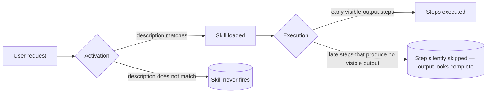

# Execution

> **Why a skill that is loaded is not the same as a skill that runs to the end. And why every verification step in Swarm's skills forces visible output.**

A second failure mode lives downstream of activation. Marc Bara's analysis [\[4\]](./sources.md#4) names it directly: *"Claude skills have two reliability problems, not one."* The first is activation. The second is **execution drift** — late-stage steps inside an already-loaded skill being silently skipped.

---

## The two reliability problems, side by side



| Problem | Symptom | Source |
| --- | --- | --- |
| **Activation failure** | The skill never loads. The user sees the agent answering without the skill's discipline. Detectable by inspecting the session log. | [\[3\]](./sources.md#3) — the 650-trial study. |
| **Execution failure** | The skill loads, the early steps run, but later steps that would only produce a yes/no result are quietly skipped. The agent's final output looks complete. | [\[4\]](./sources.md#4) — the two-reliability-problems analysis. |

Bara's point is that the second mode is invisible from the outside: the answer arrives, the structure looks right, the verification claim is asserted — and the verification command was never run. The fix is structural: any step that *should* produce visible output must be required to produce that output.

---

## The forced-visible-output pattern

Every skill in the layer that asks the agent to verify a claim follows the same shape:

> **Hard gate.** The task is not complete until <some specific output> appears verbatim in the document.

Three implementations, picked because they map cleanly to three different evidentiary domains.

### Code verification — `empirical-proof`

The universal codification of the pattern. Rules 2 and 6 of `empirical-proof`:

| Rule | What it requires | What it forces |
| --- | --- | --- |
| **2. Verbatim pasting** | Verbatim output pasted into `## Self-review`, fenced, no paraphrase, last two lines minimum (the runner's summary plus its timing/exit conditions). | Removes the option of "trust me, it passed". |
| **6. Paste, don't quote** | Raw fenced code blocks; no quoting, no Markdown styling, no inline annotation; treat the output as data. | Closes the bypass where the agent paraphrases the output. |

Common evasions — and the response — are listed in the `empirical-proof` skill's `references/evasions.md`.

### Test verification — `write-testing` rule 3

The "flip the assertion" pattern. `write-testing` rule 3 makes it a per-test loop: after writing each test, flip its assertion (or comment out the production code path it exercises); run the test — it must fail; restore — it must pass; paste a representative sample of the failing-then-passing transition into the self-review.

Without the flip, *"the test passes"* is unfalsifiable from pasted output alone — the test could be tautological, or fail for a different reason, or simply never run. Flipping the assertion exposes whether the test is actually exercising the intended code path. Forced visible output applied to test authorship.

### Research verification — `write-research` rule 11

From `write-research`:

> Do not finalise the research doc until every paragraph in `## Findings` ends with a `[N]` citation **and** every claim not yet verified is bracketed `[unconfirmed]`.

The forced output is the citation marker itself. *"It's well known that…"* without a `[N]` is a missing-output signal; the rule pushes that signal into the document where the next reviewer can see it.

---

## More patterns, same principle

| Skill | Forced output | Failure mode it closes |
| --- | --- | --- |
| `write-spec` rule 7 | *"Before delivering, output the `[CRITICAL]` open-question list and confirm none remain."* | Open-spec questions slipping into implementation. |
| `write-audit` rule 9 | *"Every issue row has a non-empty `Needed` column and a file:line reference."* | Findings that are observations dressed up as actions, with no anchor in the code. |
| `write-bug-report` rule 8 | *"Do not finalise until the failing reproduction output is pasted verbatim."* | Bug reports asserting "the bug fires" without proof. |
| `distillation-discipline` rule 4 | A four-test result table is written into the deliverable. | Distillation collapsing into paraphrase without measurable compression. |

The pattern generalises: *if the rule's compliance is otherwise invisible, force it to produce a marker the next agent or human can see.*

---

## The deeper pattern: verbal feedback as a learning signal

Forced visible output isn't only a verification trick — it's the same mechanism Reflexion [\[27\]](./sources.md#27) identifies as the *"semantic gradient signal"* that makes language agents improve across trials.

> Reflexion (Shinn et al., NeurIPS 2023) measured the effect at scale: agents that wrote a verbal self-reflection between failed attempts and re-read it on the next attempt reached **91 % pass@1 on HumanEval** vs **80 % for GPT-4 alone** — a +11 pp gain attributable to the written reflection.

The connection is direct. Reflexion's loop:

```text
Attempt → Failure → Verbal reflection (written down) → Next attempt reads the reflection
```

…is the per-trial version of the per-rule discipline this document describes:

```text
Rule fires → Output is required → Output is pasted verbatim → Next reader (agent or human) sees the marker
```

In both cases, the trick is the same: **a written artefact converts an implicit signal into a durable one.** Agents that produce the artefact perform better than agents that hold it in attention. The same principle drives the iteration trail in `write-fix` and the augmented hypothesis tracker in `fix-flaky-test` — see [Task files § Verbal reflection beats no reflection](./task-files.md#verbal-reflection-beats-no-reflection).

---

## Why this matters more than activation

The two failure modes have different recoverability properties:

| Failure mode | Visible to user | Visible in session log | Recoverable mid-session |
| --- | --- | --- | --- |
| **Activation** | Yes — the agent answers without the skill's voice; structure differs | Yes — the skill never loads | Yes — user can re-prompt |
| **Execution** | No — output looks complete | Sometimes, if the verification command's absence is checked | No — the work is "done" |

Activation failures are loud. Execution failures are quiet. The forced-visible-output pattern is the cheapest available defence against the quiet ones.

> The exact failure [\[4\]](./sources.md#4) describes — *"the skill loaded, the verification step was skipped, the output looked complete"* — is the failure mode `empirical-proof` was written to defend against. Every skill that depends on a verification step inherits the pattern.

---

## See also

- [Activation](./activation.md) — the first reliability problem.
- [Body anatomy](./body-anatomy.md) — why rules are paired with rationales (so the model knows *what* to verify).
- [Task files](./task-files.md) — Reflexion-shaped iteration trails for `write-fix` and `fix-flaky-test`.
- [Sources](./sources.md) — full bibliography.
