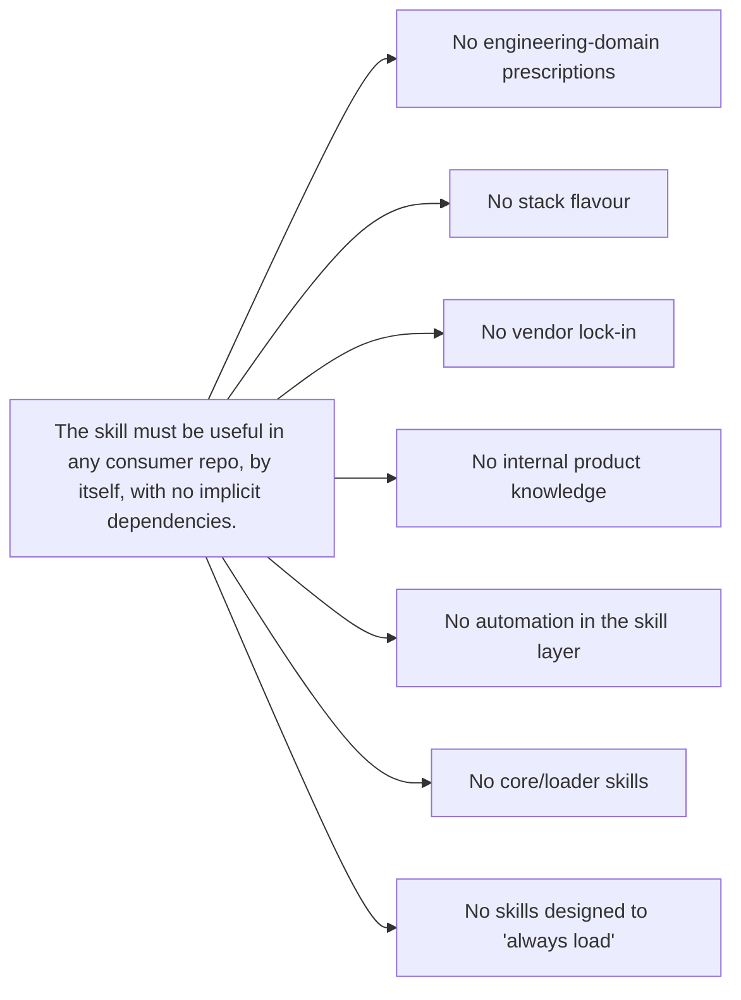

# Scope

> **What Swarm's skill layer is, what it deliberately is not, and the principle behind every exclusion.**

Most skill collections define themselves by what they contain. Swarm's skill layer is also defined by what it deliberately leaves out — and each exclusion has a reason that ties back to one of the other documents in this directory.

---

## What the skill layer is

Swarm's skills (under `.agents/skills/` in the scaffold) are **universal agent-workflow skills for product-development tasks** — code authoring and documentation production. Each skill is a self-contained discipline that an agent loads when the task matches its description.

| Domain                       | Shape of skills shipped                                                                                                                                                            |
| ---------------------------- | ---------------------------------------------------------------------------------------------------------------------------------------------------------------------------------- |
| **Code authoring**           | Workflow skills for implementing features, fixing bugs, refactoring, rewriting, migrating, optimising performance, and improving test coverage.                                    |
| **Documentation production** | Author-time skills for specs, research, audits, bug reports, user-facing documentation, and Architectural Decision Records.                                                        |
| **Specialised work**         | Single-purpose skills like stabilising flaky tests.                                                                                                                                |
| **Quality gates**            | Cross-cutting disciplines like empirical proof (paste-output), adversarial review, and distillation discipline (drop-vs-keep accountability when summarising).                     |
| **Conditioning**             | Seven standalone `persona-<name>` skills — `persona-architect`, `persona-auditor`, `persona-janitor`, `persona-migrator`, `persona-performance-surgeon`, `persona-skeptic`, `persona-surveyor`. Each is independently vendorable. |

Every skill answers the question _"how should an agent shape its work for tasks of this type?"_ — not _"what should an engineer know about this domain?"_.

---

## What the skill layer is not

Six categories are deliberately excluded. Each exclusion has a documented reason.

### 🚫 No engineering-domain knowledge

```text
Out of scope: auth-patterns, observability, caching, postmortem-format,
              incident-response, idempotency, rate-limiting, runbooks
```

**Why.** Skills here describe _how an agent works on a task_, not _what an engineer should know about a problem_. A skill called `auth-patterns` would either:

- prescribe one company's chosen pattern (couples the skill to a stack — see also the next exclusion); or
- enumerate every possible pattern (an everything-skill, anti-pattern [\[6\]](./sources.md#6) and length-cap violation [\[2\]](./sources.md#2)[\[5\]](./sources.md#5)).

Either way the failure mode is documented in the literature. The skill is rejected.

The right home for this content is the consuming repo's `AGENTS.md > Architecture` and `AGENTS.md > Conventions`, which the universal skills already reference. See [Self-containment § The AGENTS.md contract](./self-containment.md#rule-2-project-specific-values-come-from-agentsmd).

> **Empirical reinforcement.** ETH Zurich's evaluation of `AGENTS.md` files [\[32\]](./sources.md#32) measured this split directly. **Tool-specific commands** in the consuming repo's `AGENTS.md` produced an explicit-tool call rate of **2.5 per task when mentioned vs 0.05 when not** — a ~50× lift. **Architectural overviews and engineering-domain narrative**, by contrast, contributed almost nothing measurable; LLM-generated context files of that style cost **+20 % in tokens for –3 % in success rate**. Swarm's split (universal _how-to-work_ skills here, project-specific _what-to-run_ commands in the consumer's `AGENTS.md`) is the empirically supported configuration.

### 🚫 No stack-specific or vendor-specific skills

```text
Out of scope: react-19-best-practices, postgres-index-patterns, datadog-alerts,
              snowflake-warehouse-design, aws-vpc-conventions
```

**Why.** Skills are loaded into context regardless of the project the agent is working in. A skill that speaks React 19 is dead weight in a Python service. Beyond the cost in tokens, the agent is left to disambiguate which skill applies — directive saturation [\[3\]](./sources.md#3) (discussion section).

Stack-specific patterns belong in **a project's own `.agents/skills/domain/` folder**, or in stack-specific skill collections that consumers vendor only when the stack is in play. Public collections like `vercel-labs/agent-skills`, `wshobson/agents`, and `elastic/agent-skills` [\[12\]](./sources.md#12)[\[14\]](./sources.md#14)[\[13\]](./sources.md#13) complement Swarm's universal layer without being conflated with it.

### 🚫 No internal-product or vendor-specific docs

```text
Out of scope: internal product knowledge, business-logic wikis, vendor-specific runbooks
```

**Why.** Same reason as the previous two — coupling. Internal product knowledge lives in product repos; the skill layer is generic so it can be vendored across them.

### 🚫 No automation, scripts, CI, or evaluation harnesses in the skill layer

```text
Out of scope: scripts/validate.mjs, .github/workflows/*.yml, eval harnesses,
              build-readme generators, plugin manifests
```

**Why.** The skill layer's purpose is to be a **container for skills + their surrounding documentation**, nothing more. Automation has three failure modes that work against that purpose:

| Failure                                                                                      | Consequence                                                                            |
| -------------------------------------------------------------------------------------------- | -------------------------------------------------------------------------------------- |
| **Drift** — automation falls out of sync with the skills it's supposed to validate.          | The signal becomes false; reviewers either chase ghosts or learn to ignore the alerts. |
| **Lock-in** — automation chooses one runtime, one validator, one evaluation harness.         | A consumer on a different stack inherits an obstacle.                                  |
| **Scope creep** — automation invites tooling-of-tooling (workflow workflows, eval evals, …). | The layer accretes infrastructure that has nothing to do with the skills themselves.   |

If validation tooling proves load-bearing, it lives in **its own place** consumed by the maintainer's CI — not inside the skill layer. Reviews are reviewer-driven against the rules in the [writing-skills guide](../../guides/writing-skills.md) and the directives in `AGENTS.md`.

### 🚫 No "core" / "loader" / "index" skill that other skills depend on

```text
Out of scope: personas-core, write-core, validation-core, any "loader" skill that other skills depend on
```

**Why.** This is a direct application of [Self-containment](./self-containment.md). The progressive-disclosure model [\[1\]](./sources.md#1)[\[2\]](./sources.md#2) says each skill loads on its own metadata; introducing a "core" skill that other skills assume is loaded breaks that model. The persona discipline demonstrates the alternative — a folder per persona (seven of them), each independently vendorable, no shared core, no cross-references.

### 🚫 No skills designed to "always load"

```text
Out of scope: any skill whose description matches every task
              ("handles all X", "use on every request",
              "general assistance", catch-all triggers)
```

**Why.** The community catalogue [\[6\]](./sources.md#6) names this directly under three headings — _The Everything Skill_, _Description Soup_, and _Missing Exclusions_ — and Anthropic's own framing [\[17\]](./sources.md#17) draws the architectural line: skills are for **multi-step procedures** loaded on trigger; **persistent context** (facts, project conventions, project commands) belongs in `CLAUDE.md` / `AGENTS.md`. A "skill" authored to always be resident is the wrong primitive — its content lives in the consuming repo's `AGENTS.md` instead. This is why Swarm ships **no always-loaded skill**: the task-file lifecycle discipline that once lived in such a skill now lives in the task templates and process docs, and the routing rules became framework concept-docs in `AGENTS.md`. The eager-loading bug in current Claude Code [\[34\]](./sources.md#34)[\[35\]](./sources.md#35) compounds the cost: even disciplined skills consume ~100 tokens of metadata each at session start, so an "always loaded" description multiplies a problem the consumer can already barely afford. Full case in [Activation § The "always-load" anti-pattern](./activation.md#the-always-load-anti-pattern).

---

## The principle behind every exclusion



Every exclusion above is a corollary of one principle: **a skill must be useful in any consumer repo, by itself, with no implicit dependencies on other skills, on the layer's tooling, or on a particular stack.**

When a candidate skill is proposed, the gating question is:

> _Could this skill be vendored by a team using a different language, a different framework, a different CI provider, and a different agent — and still produce its intended behaviour, with no other skill in context?_

If the answer is _"yes"_, the skill belongs in the universal layer. If _"no"_, it belongs somewhere else — usually the consuming project's own `AGENTS.md`, its `.agents/skills/domain/` folder, a stack-specific skill collection, or an internal docs site.

---

## See also

- [Self-containment](./self-containment.md) — the principle that drives every exclusion above.
- [Task files](./task-files.md) — externalised state is _in scope_ (it's a workflow shape); engineering-domain knowledge is not.
- [Skills index](../README.md) — documentation about the shipped skills.
- [writing-skills guide](../../guides/writing-skills.md) — when to write a project-specific skill vs add to `AGENTS.md` vs add to `docs/`.
- [Sources](./sources.md) — full bibliography.
