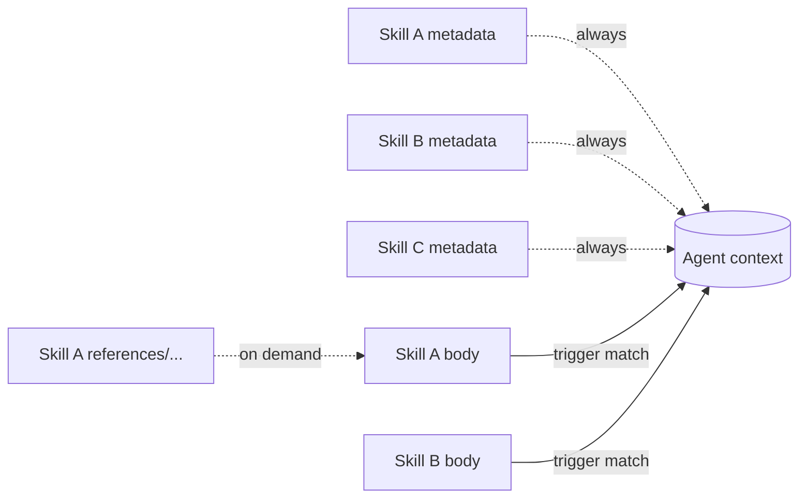
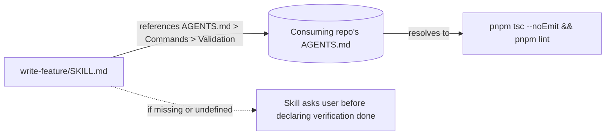

# Self-containment

> **Why no `SKILL.md` references another skill, why project-specific values resolve through `AGENTS.md`, and why the personas live in individual folders rather than one shared index.**

Skills vendor individually. A user who copies `write-feature` into their repo does not have `empirical-proof` in their context unless they also copy it. The skill layer has to assume that — every shipped skill stands alone, with no implicit dependencies on its siblings.

---

## The progressive-disclosure model

The open spec [\[1\]](./sources.md#1) defines skills as **independently loaded units**:



Each skill's metadata is in context regardless of which other skills are installed. The body loads when the description matches. References load on demand, scoped to that skill.

The structural consequence is non-trivial: **a skill cannot assume any other skill is in context**. If `write-feature` *expects* `empirical-proof`'s discipline, that discipline has to be either restated inline or re-derivable from `write-feature` alone.

---

## Rule 1: no cross-skill references in `SKILL.md`

Anti-pattern catalogues converge on the same finding [\[6\]](./sources.md#6) — *"Reference Illusion"*: skills referencing files or skills that may not exist on the consumer's machine. The consequence is a dead reference that silently degrades behaviour.

| Source | Finding |
| --- | --- |
| [\[1\]](./sources.md#1) Open spec | Each skill's metadata loads independently; no implicit ordering between skills. |
| [\[2\]](./sources.md#2) Anthropic best practices | Recommends *"focused, composable skills"*. |
| [\[6\]](./sources.md#6) Skill anti-patterns | "Reference Illusion" — linking to skills/files that aren't guaranteed to be present. |

**Applied in Swarm's skills:** the [writing-skills guide](../../guides/writing-skills.md) carries the hard rule:

> *"No cross-skill references in `SKILL.md`. If a related discipline is load-bearing, restate the rule inline (one or two sentences). Do not link to a sibling skill. No framework-internal paths (`.agents/…`, `docs/…`) in the body either."*

Cross-skill links exist only in the *meta* docs (this `docs/skills/building/` directory and the surrounding guides) — never inside a `SKILL.md` body.

> A linked skill that isn't installed is a dead reference; an inline one-sentence restatement is robust.

---

## Personas: the canonical worked example

The persona discipline is where the self-containment principle does its loudest work. Swarm ships seven persona skills — `persona-architect`, `persona-auditor`, `persona-janitor`, `persona-migrator`, `persona-performance-surgeon`, `persona-skeptic`, `persona-surveyor` — each a fully standalone skill. Copying `write-audit` does not pull in `persona-auditor`.

```mermaid
flowchart TD
    UR[User: "audit the auth module"] --> AGT[Agent assesses task]
    AGT -->|matches description| WA[write-audit loads]
    AGT -->|matches description| PA[persona-auditor loads]
    WA -.no link to.-> PA
    PA -.no link to.-> WA
    WA & PA --> CTX[(Both in context, neither depends on the other)]
```

| Property | How it's enforced |
| --- | --- |
| **Each persona is a separate skill folder** | `persona-auditor/SKILL.md`, `persona-skeptic/SKILL.md`, … one folder per persona, each ~60–70 lines. |
| **Each persona activates from task assessment, not from cross-skill mention** | Each `description` names the task type the persona is for, e.g. *"ALWAYS apply this skill when authoring an audit of present state"*. The agent loads the persona because the task matches, not because another skill mentioned it. |
| **No persona index / core / loader skill** | There is no `personas-core`, no `personas` monolith. Each persona is independently vendorable. |
| **Personas are not referenced from any other skill** | `Grep` across the skill layer for `persona-` returns zero hits inside non-persona `SKILL.md` files and zero hits inside any `references/task-template.md`. The only matches are within the persona files themselves, where "personas" appears as a concept word ("do not blend personas"). |

> A consumer who vendors only `write-audit` and `persona-auditor` gets the same behaviour they'd get with the full set copied in — neither file mentions the other.

> Swarm's persona catalogue documents 13 mindsets, but only these 7 ship as runtime skills. The other 6 (Builder, Bug Hunter, Documentarian, Lead Engineer, Researcher, Test Author) are carried by the matching workflow skill (Builder→`write-feature`, Bug Hunter→`write-bug-report`, Documentarian→`write-documentation`, Researcher→`write-research`, Test Author→`write-testing`; Lead Engineer is orchestration, no skill). The same self-containment rule applies: those workflow skills do not link the persona docs either.

---

## Rule 2: project-specific values come from `AGENTS.md`

Skills are universal. The consuming repo holds project-specific values. Hardcoding `pnpm tsc --noEmit && pnpm lint` into a skill couples it to one stack and breaks every other consumer.

Swarm solves this with the **`AGENTS.md` command contract** — the `## Commands` section in the repo-root `AGENTS.md` the consuming project fills in. Skill bodies reference its sections by name in prose ("run the project's validation command, `AGENTS.md > Commands > Validation`") and degrade gracefully when an entry is missing.



The [open `AGENTS.md` convention](https://agents.md) is adopted by Cursor, Codex, Claude Code, OpenCode, and others [\[19\]](./sources.md#19); Swarm's contract extends it with an explicit `## Commands` section that maps each named command to a `{{cmd*}}` template placeholder (a launcher binds the placeholders in `.agents/templates/` and skill `references/task-template.md` files from the same entries).

### What the contract guarantees

| Section | Required? | Read by |
| --- | --- | --- |
| `Commands > Validation` (`{{cmdValidate}}`) | Yes | Any skill whose discipline includes running typecheck + lint as part of self-review. |
| `Commands > Test` (`{{cmdTest}}`) | Yes | Any skill that runs the test suite (feature, fix, refactor, rewrite, migration, performance, testing, flaky-test stabilisation). |
| `Commands > Format` (`{{cmdFormat}}`) | Yes | Documentation-authoring skills, plus any skill that closes a session by formatting touched files. |
| `Stack`, `Architecture`, `Conventions` | Recommended | All skills, for orientation. |

### What it deliberately doesn't cover

Some skills reference values *outside* the required trio — a benchmark command for perf work, a dependency-validator for refactor / migration / review work, a build command for upgrades. The `AGENTS.md` contract has **extended** entries for these (`Install`, `Typecheck`, `Build`, `ValidateDeps`, `Benchmark`, bound when the relevant work occurs). For anything still outside the contract, the convention is the same throughout the skill layer: **the skill names the descriptive concept ("the project's benchmark command"), tells the agent to ask the user for the concrete value, and flags it in the PR**. New `AGENTS.md` sections are not added unilaterally from inside a skill — if the same question recurs every session, the binding is added to the contract instead.

---

## Why the cost is worth it

| Benefit | Mechanism |
| --- | --- |
| **Selective vendoring works** | Any subset of the catalogue can be copied in; nothing breaks because no skill assumes a sibling is present. |
| **Skills are stack-agnostic** | The same skill body runs in a TypeScript monorepo, a Rust crate, or a Python service — only `AGENTS.md` differs. |
| **Reviews are local** | A skill's correctness is determined by reading just that skill plus the `AGENTS.md` contract. No need to model cross-skill interactions. |
| **Forks are cheap** | A team can vendor a single skill into their own collection without porting an entire dependency graph. |

The cost is restated rules. The same discipline (e.g. *paste the actual output, not a paraphrase*) appears in `empirical-proof`, in `write-feature`, in `write-fix`, etc. — usually as one or two inline sentences rather than a link. The duplication is deliberate, not a TODO.

---

## State externalisation makes self-containment work

Self-containment relies on each skill carrying its own state. If one skill had to rely on another keeping a *shared in-memory* picture of what was decided, the skills wouldn't actually be independent — they'd be implicitly coupled through the agent's working memory.

Swarm's answer is **file-based state externalisation**: every long-running task writes to a local task file (`.agents/tasks/<slug>.md`, gitignored on the dev's machine). Each skill reads the file, writes to it, and assumes nothing about what other skills did beyond what's recorded there. The file is personal working memory, not a team artefact — see [Task files § Where the task file lives](./task-files.md#where-the-task-file-lives-gitignored-local-personal).

The empirical case for this is unusually direct. InfiAgent [\[29\]](./sources.md#29) ran an ablation study removing file-based state externalisation from their long-horizon agent and measured a **21× performance degradation**. Anthropic's three-file pattern [\[20\]](./sources.md#20) and the Claude Code Tasks system [\[23\]](./sources.md#23) converge on the same shape from a different angle. The full case is in [Task files](./task-files.md).

For self-containment specifically, the implication is structural: **state is shared through the file, not through implicit context**. A skill that needs prior findings reads them from the task file. A skill that needs to record a decision writes it to the task file. No skill assumes another skill kept anything in attention.

> Without file-based state, "self-contained skills" would be a polite fiction — every skill would secretly depend on the agent's memory of what its siblings did. The task file is what makes the independence real.

---

## See also

- [Activation](./activation.md) — exclusion clauses name the *task types* a skill is not for, never sibling skill names. The agent disambiguates by matching the user's task to whichever sibling's `ALWAYS apply when…` clause triggers.
- [Body anatomy](./body-anatomy.md) — body length budgets factor in inline restatement.
- [Scope](./scope.md) — the same self-containment principle is what excludes any "personas-core" or "loader" index skill from the layer.
- [Task files](./task-files.md) — the file-based state externalisation that lets self-contained skills coordinate.
- [Sources](./sources.md) — full bibliography.
